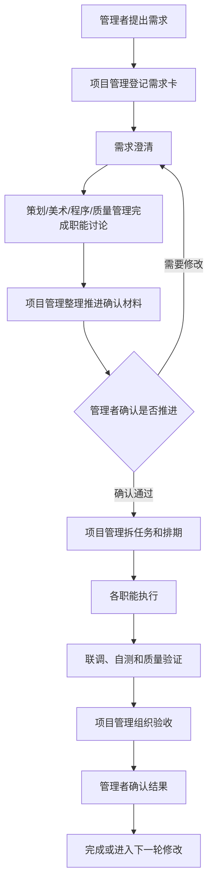

---
type: project
status: seed
created: 2026-07-03
updated: 2026-07-13
tags: [人员管理, 项目管理, 质量管理, 团队协作, Game_WaJue]
sources: []
---

# 人员管理

## 摘要

当前团队建议按“管理者 → 项目管理 → 职能讨论 → 管理者确认 → 职能执行 → 质量验证”的节奏运转：管理者只提出需求、定优先级、确认推进和做最终验收；项目管理负责把需求拆成排期、任务、风险和交付节奏；策划、美术、程序、质量管理只对明确任务和明确验收标准负责。

团队配置为：1 个项目管理、1 个质量管理、2 个策划、2 个美术、2 个程序。为了避免管理者直接指挥 8 个成员导致混乱，所有任务入口、职能讨论结论、排期变更和阻塞升级都先经过项目管理。

## 需求看板

-[[需求看板]]] — 查看管理者对各职能下达的需求、完成进度、低 / 中 / 高评分，以及对应需求相关的跳转链接。

## 团队角色

| 角色 | 人数 | 核心职责 | 不负责 |
|---|---:|---|---|
| 管理者 / 需求方 | 1 | 提方向、发需求、定优先级、验收结果、拍板取舍 | 日常催进度、直接给个人插单、替项目管理排期 |
| 项目管理 | 1 | 建任务池、拆排期、分配责任人、追阻塞、组织评审、输出周报 | 替职能成员做专业决策 |
| 质量管理 / QA | 1 | 制定验收清单、测试用例、缺陷分级、质量风险提醒、回归验证 | 替策划、美术、程序完成专业交付 |
| 策划 | 2 | 玩法规则、系统文档、关卡/数值/配置、验收标准 | 无需求来源时自行发散 |
| 美术 | 2 | 视觉规范、UI/场景/角色资源、动效、资源导出规范 | 接收没有规格和尺寸的口头需求 |
| 程序 | 2 | 功能实现、工程结构、工具、接入、联调、性能和 Bug 修复 | 接收没有策划规则和美术规格的需求 |

## 推荐分工

### 项目管理

- 维护一个唯一任务池：所有需求、任务、Bug、风险都进入同一个池子。
- 每周输出一版排期：本周做什么、谁负责、何时验收、有什么风险。
- 控制变更：除 P0 级严重问题外，管理者的新想法默认进入下周排期，不直接打断本周任务。
- 收齐各职能讨论结论，准备推进前统一提交管理者确认。
- 组织固定节奏：周计划、每日同步、周验收、周复盘。

### 质量管理 1 人

- 从需求澄清阶段开始参与，提前理解需求目标和验收方式。
- 为 P0 / P1 需求准备验收清单、测试重点和风险提示。
- 在策划、美术、程序准备推进前，检查是否存在遗漏的边界条件、交付标准或质量风险。
- 执行后负责测试、记录缺陷、推动回归，并向项目管理同步质量状态。
- 对严重质量风险有权要求项目管理拉回管理者确认。

### 策划 2 人

- 策划 A：偏系统 / 玩法 / 核心循环 / 需求拆解。
- 策划 B：偏关卡 / 数值 / 配置 / 文案 / 测试反馈整理。
- 策划交付物不是“想法”，而是可被程序和美术执行的规格：
  - 玩法目标
  - 操作流程
  - 规则边界
  - 数据表字段
  - UI 信息结构
  - 验收标准

### 美术 2 人

- 美术 A：偏视觉规范、关键界面、风格控制。
- 美术 B：偏量产资源、切图、动效、导出、占位资源替换。
- 美术交付物需要带规格：
  - 尺寸
  - 命名
  - 格式
  - 使用场景
  - 是否临时资源
  - 是否需要程序接入

### 程序 2 人

- 程序 A：偏核心系统、架构、数据、玩法逻辑。
- 程序 B：偏 UI、工具、资源接入、联调、Bug 修复。
- 程序交付物以“可运行、可演示、可验收”为准，不只以代码完成为准。

## 运转主流程



## 管理者只需要做的事

管理者不要直接管理 8 个成员，只保留 5 个动作：

1. **发需求**：用 [[知识库/项目/人员管理/管理者提需求]] 的需求卡说明“为什么做、做成什么样、优先级是什么”。
2. **定优先级**：告诉项目管理哪些是必须做，哪些可以延后。
3. **确认推进**：每个职能讨论完成、准备进入下一阶段前，由管理者确认是否推进。
4. **看演示**：每周只看可运行结果或明确交付物。
5. **拍板取舍**：当时间、质量、范围冲突时，决定砍范围、延期还是加资源。

## 项目管理每日要做的事

- 看任务池是否有未澄清需求。
- 检查每个成员当前只做 1–2 个主要任务，避免多人多线失控。
- 跟进阻塞项：缺文档、缺图、缺接口、缺决策、缺验收。
- 检查是否有“职能讨论已完成但尚未管理者确认”的推进项。
- 把风险提前同步给管理者，而不是等到延期后再解释。
- 维护今日状态：
  - 昨天完成了什么
  - 今天做什么
  - 卡在哪里
  - 是否影响本周目标

## 任务状态

建议所有任务只用以下状态，避免状态过多：

| 状态 | 含义 |
|---|---|
| 待澄清 | 需求还不够明确，不能排期 |
| 待拆分 | 需求明确，但还没拆成策划 / 美术 / 程序 / 质量管理任务 |
| 待管理者确认 | 职能讨论已经完成，准备推进到下一阶段，等待管理者确认 |
| 已排期 | 已进入本周或指定迭代 |
| 进行中 | 责任人正在执行 |
| 待联调 | 单人任务完成，等待跨职能接入 |
| 待验收 | 已可演示，等待项目管理或管理者确认 |
| 已完成 | 验收通过 |
| 阻塞 | 缺资源、缺决策、缺依赖，无法继续 |

## 需求卡模板

管理者每次分发需求时，尽量按这个格式给项目管理；完整说明见 [[知识库/项目/人员管理/管理者提需求]]：

```markdown
## 需求名称

- 背景 / 目的：
- 玩家价值：
- 优先级：P0 / P1 / P2
- 期望结果：
- 范围包含：
- 范围不包含：
- 参考资料：
- 验收方式：
- 截止期望：
- 是否必须本周完成：
```

## 任务卡模板

项目管理把需求拆给成员时，建议每张任务卡都包含：

```markdown
## 任务名称

- 来源需求：
- 职能：策划 / 美术 / 程序 / 质量管理
- 责任人：
- 协作人：
- 交付物：
- 验收标准：
- 前置依赖：
- 管理者确认记录：
- 预计工期：
- 截止时间：
- 当前状态：
- 风险 / 阻塞：
```

## 周节奏

| 时间 | 会议 / 动作 | 参与人 | 输出 |
|---|---|---|---|
| 周一 | 周计划会 | 管理者、项目管理、各职能代表 | 本周目标、任务列表、责任人、验收点 |
| 周二到周四 | 每日 10 分钟同步 | 项目管理、执行成员 | 昨日完成、今日计划、阻塞 |
| 周三 | 推进确认 / 风险检查 | 管理者、项目管理、必要职能代表 | 职能讨论结论是否通过、是否砍范围、调优先级、改排期 |
| 周五 | 演示验收 | 管理者、项目管理、相关成员 | 通过 / 修改 / 延后 |
| 周五 | 复盘和下周预排 | 项目管理、执行成员 | 问题记录、下周候选任务 |

## 第一周启动步骤

1. 项目管理先建一个总任务池，把管理者脑中的需求全部登记，不急着排期。
2. 管理者给所有需求标 P0 / P1 / P2：
   - P0：没有它游戏不能验证。
   - P1：影响体验，但可以晚一点。
   - P2：锦上添花。
3. 只选一个最小可玩版本作为第一周目标，不要同时开很多系统。
4. 策划先把 P0 需求写成可执行规格。
5. 美术、程序、质量管理分别讨论实现方式、资源需求、测试重点和风险。
6. 项目管理整理职能讨论结论，提交管理者确认，通过后再拆任务排期。
7. 项目管理拆成策划、美术、程序、质量管理任务，并安排责任人。
8. 每天只同步阻塞和偏差，不开长会。
9. 周五必须演示，不管完成度如何，都要暴露真实进度。

## 关键规则

- **一个入口**：所有任务先进项目管理，不直接找成员插单。
- **一个优先级**：优先级由管理者定，但排期由项目管理评估。
- **一个责任人**：每张任务卡只能有一个最终责任人。
- **一个验收标准**：没有验收标准的任务不能进入开发。
- **一个推进门禁**：每个职能讨论完成、准备推进前，必须通过管理者确认。
- **质量前置**：质量管理从需求澄清阶段介入，不等到最后才测试。
- **少开并行**：每个人最多同时承担 1 个主任务 + 1 个小修任务。
- **变更入池**：新想法先进任务池，默认下周评估。

## 常见风险

- 管理者直接给个人发任务，项目管理失去全局排期。
- 策划文档不够细，程序和美术靠猜。
- 美术资源没有尺寸、命名、导出规范，程序接入返工。
- 程序只说“写完了”，但没有可演示版本。
- 职能讨论后没有管理者确认就直接推进，导致方向偏差或返工。
- 质量管理介入太晚，只能发现问题，无法提前降低风险。
- 周五不验收，问题拖到下一周才暴露。

## 关联

- [[知识库/项目/人员管理/管理者提需求]]
- [[知识库/项目/职能分工/总览]]
- [[知识库/项目/职能分工/质量管理/说明]]
- [[知识库/项目/职能分工/公共/说明]]
- [[游戏规划]]

## 待办 / 问题

- 待补：建立具体任务池页面。
- 待补：建立每周排期表模板。
- 待补：建立管理者推进确认记录页面。
- 待定：是否使用 Obsidian、飞书、多维表格或其他工具承载任务看板。
