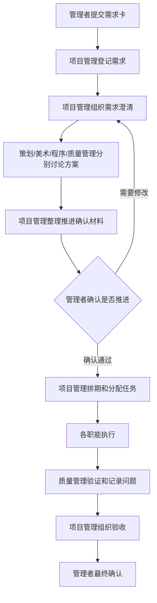

---
type: project
status: seed
created: 2026-07-13
updated: 2026-07-13
tags: [管理者提需求, 需求管理, 项目管理, 质量管理, Game_WaJue]
sources: []
---

# 管理者提需求

## 摘要

管理者提需求的目标不是直接给策划、美术、程序派活，而是把“为什么做、优先级、做到什么程度、如何验收”交给项目管理，由项目管理组织拆解、排期和分配。

新增规则：每个职能完成讨论、准备进入下一阶段前，都要先由项目管理整理“推进确认材料”，提交管理者确认。管理者确认后，项目管理才能安排进入文档定稿、资源制作、程序开发、联调、测试或发布。

## 提需求原则

- **一个入口**：需求只交给项目管理，不直接插给个人。
- **一个目标**：每次尽量只提一个明确目标，避免把多个需求混在一起。
- **一个优先级**：管理者给 P0 / P1 / P2，项目管理负责排期。
- **一个验收方式**：必须说清楚看什么结果才算通过。
- **一个推进确认点**：职能讨论完成后，准备推进前必须让管理者确认。

## 管理者提需求流程



## 需求卡模板

管理者每次提需求时，建议直接复制以下模板：

```markdown
## 需求名称

- 背景 / 目的：
- 玩家价值：
- 优先级：P0 / P1 / P2
- 期望结果：
- 范围包含：
- 范围不包含：
- 参考资料：
- 验收方式：
- 截止期望：
- 是否必须本周完成：
- 管理者备注：
```

## 推进确认材料模板

每个职能讨论完成、准备推进前，由项目管理整理下面这份材料给管理者确认：

```markdown
## 推进确认：需求名称 / 职能

- 来源需求：
- 当前职能：策划 / 美术 / 程序 / 质量管理
- 讨论参与人：
- 讨论结论：
- 准备推进到的阶段：文档定稿 / 资源制作 / 程序开发 / 联调 / 测试 / 发布
- 本阶段交付物：
- 验收标准：
- 预计成本：
- 主要风险：
- 需要管理者确认的问题：
- 管理者结论：通过 / 修改后再看 / 暂停
- 确认日期：
```

## 管理者确认时只看 5 件事

1. **方向是否对**：这个方案是否符合当前游戏目标。
2. **范围是否可控**：有没有偷偷扩大需求。
3. **优先级是否合理**：现在做它是否比其他任务更重要。
4. **成本是否接受**：时间、人力、返工风险是否值得。
5. **验收是否清楚**：做完以后能不能明确判断通过或不通过。

## 哪些情况必须重新确认

- 需求目标变化。
- 功能范围扩大。
- 美术风格或核心视觉方向变化。
- 程序实现方式影响排期、性能或后续维护。
- 质量管理发现严重体验、稳定性或验收风险。
- 原排期明显无法完成，需要砍范围或延期。
- 任一职能准备从“讨论 / 草案”进入“正式制作 / 开发 / 发布”。

## 质量管理如何接入需求

- 在需求澄清阶段同步加入，不等到最后才测试。
- 根据需求卡提前写验收清单和测试重点。
- 在职能推进确认前，检查是否有遗漏的验收标准、风险和边界条件。
- 在执行后负责验证、记录问题、推动回归。
- 对严重质量风险有权要求项目管理拉回管理者确认。

## 管理者不要做的事

- 不绕过项目管理直接给成员派活。
- 不在没有需求卡的情况下口头要求立刻开工。
- 不在职能讨论未结束时频繁改变目标。
- 不把专业实现细节全部指定死，给策划、美术、程序留出方案空间。
- 不跳过质量管理直接认定“看起来差不多就上线”。

## 关联

- [[知识库/项目/人员管理/人员管理]]
-[[需求看板]]]
- [[知识库/项目/职能分工/总览]]
- [[知识库/项目/职能分工/质量管理/说明]]
- [[知识库/项目/职能分工/公共/说明]]

## 待办 / 问题

- 待补：把需求卡模板拆成可直接复制的任务池条目。
- 待补：建立“推进确认记录”页面，用于记录每次管理者确认结果。
